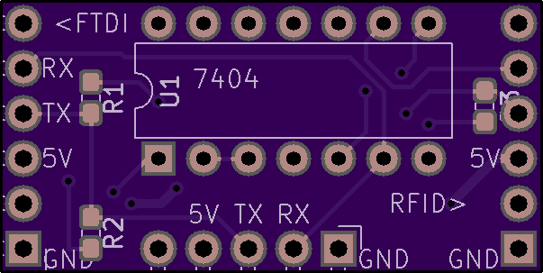
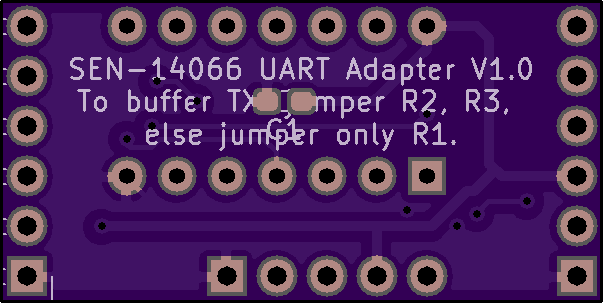

# Projects related to Sparkfun SEN-14066 UHF RFID board

## SEN-14066-adapter

Buffer SEN-14066 TXO / UART RX with two 7404 NOT gates. Optional buffering of the RXI / UART TX also.

Sent to OSHPark for fabrication on 2018-07-15.

https://oshpark.com/shared_projects/R4Yin0K0

